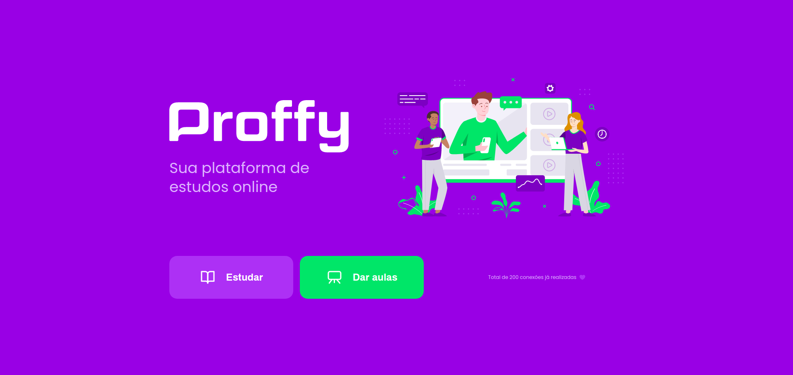

<p align="center">
  <a href="https://github.com/thiagogre/proffy/commits/master">
    
  </a>
    
   <a href="https://github.com/thiagogre/proffy/blob/master/LICENSE">  
    
   </a>

   <a href="https://github.com/thiagogre/proffy/stargazers">
    
  </a>

  <a href="https://www.linkedin.com/in/thiagogre/">
    
  </a>
</p>
<p align="center" style="display: block; align-items: center;">
  
</p>
<p align="center">
  
  
  
  
<p>
	
<h4 align="center"> 
	🚧 NextLevelWeek 🚧 In Progress... 🚀
</h4>

<p align="center">
 <a href="#-about-the-project">About</a> •
 <a href="#%EF%B8%8F-Days">Days</a> •
 <a href="#-how-it-works">How it works</a> • 
 <a href="#-tech-stack">Tech Stack</a> • 
 <a href="#-how-to-contribute">How to contribute</a> • 
 <a href="#-author">Author</a> • 
 <a href="#user-content--license">License</a>
</p>


## 💻 About the project

My version of project made on [NextLevelWeek](https://nextlevelweek.com/inscricao/2)
by [Rocketseat](https://rocketseat.com.br/). 

---

## ⚙️ Days

- [x] Monday, August 3
- [x] Tuesday, August 4
- [x] Wednesday, August 5
- [x] Thursday, August 6
- [x] Friday, August 7

---

## 🎨 Layout

<p align="center" style="display: block; align-items: center;">
  
</p>

---

## 🚀 How it works

### Pre-requisites

Access [NextLevelWeek 2.0](https://nextlevelweek.com/inscricao/2). 
It is a good to have an editor to work with the code like [VSCode](https://code.visualstudio.com/).


#### 🧭 Running the code

```
# Install Node.js LTS (v12.x) on Ubuntu
$ curl -sL https://deb.nodesource.com/setup_lts.x | sudo -E bash -
$ sudo apt-get install -y nodejs

# Install SQLite Packages
$ sudo apt install sqlite

# Install SQLite Extension on VSCode

# Clone this repository
$ git clone https://github.com/thiagogre/proffy.git

# Access the project folder in your terminal
$ cd proffy

# Install npm
$ npm install

# Run the server
$ npm run dev

# In your browser go to (http://127.0.0.1:5500/)

# For stop running server or reboot your machine
$ Ctrl + C
```
---

## 🛠 Tech Stack

The following tech were used in the construction of the project:

-   HTML
-   CSS
-   JavaScript
-   SQLite
-   Node.js

---

## 💪 How to contribute

1. Fork the project.
2. Create a new branch with your changes: git checkout -b my-feature
3. Save your changes and create a commit message telling you what you did: git commit -m" feature: My new feature "
4. Submit your changes: git push origin my-feature
5. Open a pull request!

When the merge of your pull request is done, you can delete your branch.

You can send me as many PR's as you want, I will be honored to review and accept them!

---

## 🦸 Author


 
 <br />
 <sub><b>Thiago Gregorio</b></sub>
 <br />

[](https://www.linkedin.com/in/thiagogre/) 
[](mailto:thiagoluiz_16@hotmail.com)

---

## 📝 License

This project is under the license MIT.

Made with ❤️ by Thiago Gregorio 👋🏽 [Get in touch!](https://www.linkedin.com/in/ThiagoLuizGregorio/)

---
